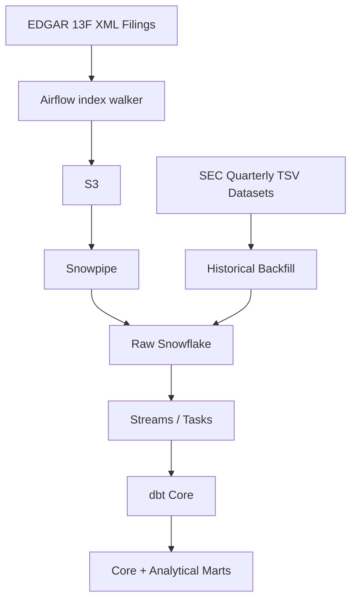

# Project 2: SEC EDGAR 13F Warehouse

## Goal

Build a Snowflake warehouse answering:

> **Who holds what, and how did institutional positions change quarter-over-quarter?**

This is the flagship project because it combines a realistic domain, semi-structured data, incremental ingestion, warehouse modeling and difficult data-quality rules.

**Snowflake timing constraint:** activate the Snowflake trial only when Steam is complete and EDGAR is ready to enter its Snowflake phase. The trial ends after 30 days **or** when the free credit balance is exhausted, whichever comes first, so the implementation must fit inside that window and careless compute can end it early. From day one: X-Small warehouse, aggressive auto-suspend, and a resource monitor capping credit consumption.

## Tech stack

| Layer                   | Technology                                     |
| ----------------------- | ---------------------------------------------- |
| Historical source       | SEC 13F structured datasets (TSV, first-party) |
| Incremental source      | EDGAR 13F XML filings                          |
| Orchestration           | Apache Airflow (Astro CLI, local)              |
| Landing                 | S3                                             |
| Ingestion               | Snowpipe auto-ingest                           |
| Warehouse               | Snowflake                                      |
| Semi-structured storage | VARIANT                                        |
| Incremental processing  | Streams & Tasks                                |
| Transformation          | dbt Core                                       |
| CI                      | GitHub Actions                                 |

### Architecture

## Historical vs incremental ingestion

### Historical backfill: TSV only

**Do not build a historical XML parser.**

The SEC publishes first-party 13F datasets that are extracted from the XML-based portions of EDGAR submissions and provided in flattened form. They already cover the historical data needed for the warehouse.

Reasoning:

- the TSV data is an official SEC representation of the structured filing data
- historical XML parsing adds large amounts of edge-case work with little additional portfolio signal
- the project needs historical volume, not an archaeological reconstruction of every filing
- time is better spent on amendment resolution, tests, incremental processing and warehouse design

The project therefore treats the TSV datasets as the **correct historical ingestion path**, not a shortcut or fallback.

### Incremental ingestion: XML

Use raw 13F XML for newly discovered filings.

This still proves the ability to:

- retrieve and store semi-structured source data
- parse XML into typed records
- handle malformed/unexpected structures
- process amendments
- incrementally update the warehouse

No time should be spent making the XML path reproduce the entire historical dataset.

## Modeling

Use a normalized core layer where it solves a real problem, then build dimensional marts. The core exists to resolve amendments and supersedence once, producing a canonical holdings state that multiple downstream marts can consume.

Core:

- `filer`
- `security`
- `filing`
- `period`
- canonical amendment / supersedence state
- `holding`

Marts:

- portfolio evolution
- new positions / exits
- concentration metrics
- institutional portfolio overlap

## Key engineering problem: amendments

13F amendments are the project's main data-correctness challenge.

The pipeline must distinguish original filings from amendments and resolve the canonical state before downstream marts consume it.

This is a stronger engineering showcase than simply demonstrating that XML can be parsed.

## Data quality

Examples:

- holding quantity and value constraints
- unique filing lineage
- amendment supersedence tests
- duplicate detection
- unit normalization across historical periods
- reconciliation between raw and canonical record counts

## Observability

Track:

- filings discovered vs loaded
- ingestion failures
- XML parsing failures
- amendment resolution failures
- duplicate/superseded filings
- raw-to-modeled row counts
- pipeline freshness

## Domain constraints

- respect EDGAR's published maximum of 10 requests/second and declare a meaningful `User-Agent` containing contact information
- do not scrape proprietary CUSIP→ticker mappings
- make identifier limitations explicit in the README
- frame analytics around filing dates and reporting periods, not real-time positions

## Snowflake features to use deliberately

Use platform features because they solve a problem:

- **VARIANT** for raw semi-structured records
- **Snowpipe** for incremental ingestion
- **Streams & Tasks** for incremental state changes
- **dbt incremental models/snapshots** where appropriate
- **Time Travel** for recovery/debugging
- **Zero-copy cloning** for a development environment
- **RBAC** to separate ingestion/transformation/analytics responsibilities

Do not add features merely to increase the technology checklist.

## Checkpoints

1. **Extraction proven, trial untouched** (`cp1-extraction`). Everything runs locally so the 30-day clock is not burning. The index walker discovers filings and downloads XML at polite rates with the declared `User-Agent`; the parser produces typed records; the TSV historical datasets are downloaded and profiled with row counts written down. Done when the parser handles representative real filings plus deliberately crafted malformed fixtures. Fixtures are built, not hunted: real malformed filings will appear during operation anyway.

2. **Snowflake ingests without hands** (`cp2-snowpipe`). Trial activated; resource monitor set the same hour. Terraform applies the stage, pipe and notification wiring; the TSV backfill is loaded. Done when a new XML file dropped in S3 appears in the VARIANT raw table with no manual step, and backfill row counts reconcile against the checkpoint 1 profile.

3. **Canonical holdings are correct** (`cp3-canonical`). The intellectual center of the project. Core layer built, supersedence state working, restatement-versus-addition logic tested. Done when a hand-picked filer with a known messy amendment history shows correct canonical holdings, and the supersedence and lineage dbt tests are green.

4. **Warehouse answers questions** (`cp4-marts`). QoQ marts live: portfolio evolution, entries and exits, concentration, overlap. Done when "what did filer X buy and sell last quarter" is one query, and the answer matches a manual spot-check against the actual filing on EDGAR's website. The external oracle matters: here is what the source says, here is what my system says.

5. **Platform is operable and recoverable** (`cp5-operability`). The purpose is operability, not feature box-checking; the features are the evidence. RBAC as operational separation, zero-copy clone as the development workflow, one recorded Time Travel recovery, audit tables populated, README done. Done when the failure demo exists as a script or recording and the README answers all eight questions.

## Stretch ideas

Alternative identifier enrichment, additional marts, or deeper Snowflake experiments may be added only after the core warehouse is correct, tested and documented.

## What this project proves

> I can design a warehouse around messy public data, separate historical backfill from operational incremental ingestion, resolve difficult data-correctness problems, and use Snowflake/dbt features for clear architectural reasons.

## Decisions

Settled 2026-09-23 at the start of cp1. Each carries a reason and a fact that can be checked. Revisions are made in place with their date.

- **Repository `edgar-13f-warehouse`, dbt project `edgar_13f_warehouse`, Snowflake database `EDGAR_13F`.** Same pattern as `steam-player-analytics`: source first, then what the thing is, kebab-case, no technology names. Rejected: `sec-edgar-13f-warehouse` says SEC twice, `sec-13f-warehouse` drops the specific name, `institutional-holdings-warehouse` describes the question and hides the source.
- **Airflow schedules the index walker and the XML downloader: daily, `catchup=True`, `max_active_runs=1`.** EDGAR keeps every daily index file under `Archives/edgar/daily-index/`, so a day missed with the laptop off is backfilled by the next run. 13F filings arrive in waves 45 days after quarter end, so daily polling is enough. GitHub Actions on a cron was considered and set aside: it gains freshness while the laptop is closed and loses run-level observability. GitHub Actions stays for CI.
- **Packaging: uv, `requires-python == 3.14.*`, ruff `>=0.16` at line length 100.** `requirements.txt` is what the Astro Runtime image installs; `pyproject.toml` mirrors it for the IDE and tests. Runtime 3.3-7 ships Airflow 3.3.1 and neither the amazon nor the snowflake provider, so both are pinned in `requirements.txt`. Ruff 0.16 grew the default rule set from 59 to 413 rules; the floor keeps that from moving under `uv sync`.
- **Terraform manages S3 and the Snowflake stage, pipe and notification wiring. RBAC is numbered SQL under `include/sql/`.** Roles are the operability story of cp5 and read better as scripts run in order than as provider resources bound to local state. State is local; remote state is a "what would change in production" line.
- **The cp3 test filer is chosen by profiling, not by name.** From COVERPAGE across every zip, rank CIKs by the count of 13F-HR/A rows per period where AMENDMENTTYPE takes both values. The CIK and the reason are written here when found.
- **One Airflow pool, `edgar`, one slot and a client ceiling of 8 requests per second.** The SEC limit is 10 per second per client and Airflow runs tasks in parallel. One slot serializes every EDGAR-calling task so a single limiter in the client governs the rate.
- **User-Agent `edgar-13f-warehouse <contact email>`.** The SEC's sample header is a name followed by a contact address. The address comes from the Airflow Variable `EDGAR_CONTACT`.

## Source facts

Checked against sec.gov on 2026-09-23 with the project User-Agent. Re-check before relying on them in a later checkpoint.

- **Dataset zips are cut by filing date, not reporting period.** 54 files, July 2013 to August 2026, 3.05 GB compressed. Older names look like `2013q2_form13f.zip`, newer ones like `01jun2026-31aug2026_form13f.zip`. A zip holds filings submitted in its window, cutoff 5:30 PM Eastern on the quarter's last business day. One period spans many zips through late filers and amendments, so cp2 reconciles per zip and the period dimension comes from PERIODOFREPORT. A COVERPAGE row in the June to August 2026 zip reports period 30-SEP-2001.
- **VALUE changed units on 2023-01-03.** From the SEC readme inside each zip: "Starting on January 3, 2023, market value is reported rounded to the nearest dollar. Previously, market value was reported in thousands." This is the unit normalization rule. The boundary is verified during cp1 profiling.
- **INFOTABLE carries a nullable FIGI next to CUSIP.** Filing 0001535452-26-000006 populated it on all 393 rows, 0001214659-26-011877 on none. FIGI is an open identifier, so enrichment through OpenFIGI is the strech path that respects the no-CUSIP-scraping rule. Before 2023, CUSIP is the only key.
- **The info table XML has no fixed name.** Every filing folder has `primary_doc.xml` plus one info table file named by the filer, `infotable.xml` in one filing and `AP2ReportQ22026.xml` in another. The downloader reads the folder's `index.json` instead of guessing.
- **Observed rate.** 20 sequential requests at 7.9 per second, all 200, no 429 or 403. The policy page reads "Current max request rate: 10 requests/second."
